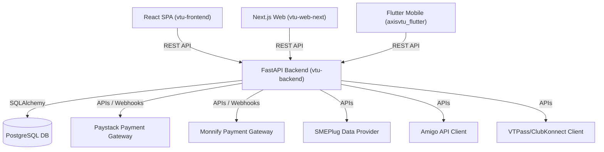
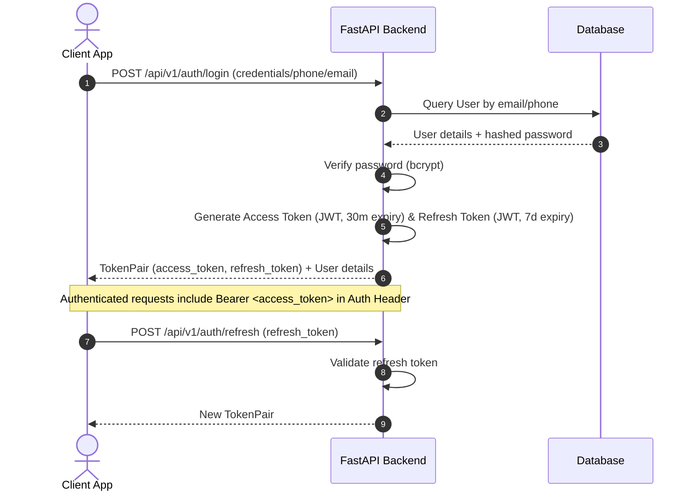
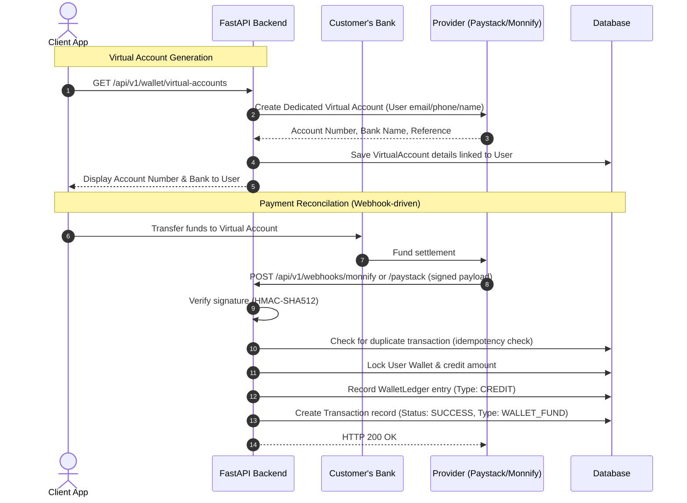

# System Architecture — MELE DATA

This document provides a comprehensive overview of the system architecture, component relationships, data flows, and database schema for the MELE DATA VTU platform.

---

## 1. System Overview

MELE DATA is structured as a multi-client, service-oriented platform built around a centralized Python/FastAPI backend API.



- **Backend API (`vtu-backend`)**: Acts as the central brain. It handles authentication, user accounts, wallet balances, transaction ledgers, service catalog mapping, and interfaces with third-party providers.
- **React Web Application (`vtu-frontend`)**: The primary dashboard for regular users and resellers to buy services, manage profiles, fund wallets, and view history.
- **Next.js Website (`vtu-web-next`)**: Handles public marketing pages, SEO-optimized landing pages, and auth entrypoints (login, registration, password reset).
- **Flutter App (`axisvtu_flutter`)**: Cross-platform Android & iOS mobile app, matching the React web app's features with biometric support and push notifications.

---

## 2. Core Flows

### A. Authentication Flow

Authentication is based on OAuth2 JWT access and refresh tokens.



### B. Wallet Funding & Payment Flow

Wallet funding is performed automatically through **dedicated/reserved virtual accounts** via Paystack or Monnify, as well as webhook triggers.



### C. Data & Airtime Purchase Flow

All purchases follow a **debit-first, auto-refund on fail** safety pattern to prevent double spending and ensure transaction integrity.

```mermaid
sequenceDiagram
    autonumber
    actor User as Client App
    participant API as FastAPI Backend
    participant DB as Database
    participant Prov as Provider API (SMEPlug/Amigo)

    User->>API: POST /api/v1/data/buy (plan_code, phone, client_request_id)
    API->>API: Enforce Rate Limits & Purchase Limits
    API->>API: Deduplicate request via client_request_id
    API->>DB: Retrieve User, Wallet, and DataPlan
    API->>API: Validate selected network matches phone prefix
    API->>API: Calculate pricing margin based on User role (USER/RESELLER)
    API->>DB: Verify wallet balance >= plan price
    
    Note over API, DB: Step 1: Debit Wallet & Create Pending Transaction
    API->>DB: Debit Wallet (Lock row)
    API->>DB: Create WalletLedger (Type: DEBIT)
    API->>DB: Create Transaction (Status: PENDING, Type: DATA)
    API->>DB: Commit DB transaction to secure funds

    Note over API, Prov: Step 2: Third-party Provider API Call
    API->>Prov: Request top-up (phone, plan_code, internal_ref)
    
    alt Provider success response
        Prov-->>API: Success (API response code)
        API->>DB: Update Transaction status to SUCCESS
        API->>DB: Commit DB transaction
        API-->>User: Success response (receipt info)
    
    alt Provider transport/timeout error
        Prov-->>API: Timeout / Connection Reset / 5xx
        API->>DB: Keep Transaction status as PENDING (resolves via cron reconcile worker)
        API->>DB: Commit DB transaction
        API-->>User: Purchase Pending (Receipt marked pending)
        
    alt Provider explicit fail response
        Prov-->>API: Failed (Insufficent provider balance / invalid number)
        Note over API, DB: Step 3: Auto-Refund
        API->>DB: Credit Wallet back
        API->>DB: Create WalletLedger (Type: CREDIT, refund reference)
        API->>DB: Update Transaction status to REFUNDED
        API->>DB: Commit DB transaction
        API-->>User: Error response (wallet refunded)
    end
```

---

## 3. Database Schema Overview

The database uses standard SQLAlchemy models, with relationship links mapped below:

### `User` Table
- `id` (PK)
- `email` (Unique, Indexed)
- `phone_number` (Unique, Indexed)
- `full_name`
- `hashed_password`
- `role` (Enum: `USER`, `RESELLER`, `ADMIN`)
- `is_verified` (Boolean)
- `is_active` (Boolean)
- `referral_code` (String, Unique)

### `Wallet` Table
- `id` (PK)
- `user_id` (FK -> `User.id`, Unique)
- `balance` (Decimal)
- `updated_at` (DateTime)

### `WalletLedger` Table
- `id` (PK)
- `wallet_id` (FK -> `Wallet.id`)
- `amount` (Decimal)
- `balance_before` (Decimal)
- `balance_after` (Decimal)
- `ledger_type` (Enum: `DEBIT`, `CREDIT`)
- `reference` (String, Unique)
- `description` (String)
- `created_at` (DateTime)

### `Transaction` Table
- `id` (PK)
- `user_id` (FK -> `User.id`)
- `reference` (String, Unique, Indexed)
- `external_reference` (String, Indexed)
- `amount` (Decimal)
- `network` (String)
- `recipient` (String)
- `tx_type` (Enum: `DATA`, `AIRTIME`, `CABLE`, `ELECTRICITY`, `EXAM`, `WALLET_FUND`)
- `status` (Enum: `PENDING`, `SUCCESS`, `FAILED`, `REFUNDED`)
- `created_at` (DateTime)

### `VirtualAccount` Table
- `id` (PK)
- `user_id` (FK -> `User.id`)
- `provider` (Enum: `PAYSTACK`, `MONNIFY`)
- `account_number` (String, Unique)
- `bank_name` (String)
- `account_name` (String)
- `reference` (String, Unique)
- `status` (Enum: `ACTIVE`, `INACTIVE`)

### `DataPlan` Table
- `id` (PK)
- `plan_code` (String, Unique)
- `network` (String)
- `name` (String)
- `price` (Decimal)
- `allowance` (String)
- `validity` (String)
- `provider` (String)
- `is_active` (Boolean)

### `PricingRule` Table
- `id` (PK)
- `plan_id` (FK -> `DataPlan.id`, Optional)
- `role` (Enum: `USER`, `RESELLER`)
- `margin_type` (Enum: `PERCENTAGE`, `FIXED`)
- `margin_value` (Decimal)

---

## 4. Backend Application Layout

The Python FastAPI project structure is organized by layer:

- `/app/api/v1/endpoints/`: Handles HTTP requests, validations, and routes. Keep them slim.
- `/app/services/`: Contain the core business logic (e.g. balance checks, provider api executions, ledger generation).
- `/app/models/`: Declarative SQLAlchemy models.
- `/app/schemas/`: Pydantic schemas validating client request data and formatting responses.
- `/app/providers/`: Third-party adapter clients interfacing directly with service APIs (SMEPlug, Amigo, etc.).
- `/app/core/`: Application settings (`config.py`), base DB connection (`database.py`), JWT and crypt helpers (`security.py`).
